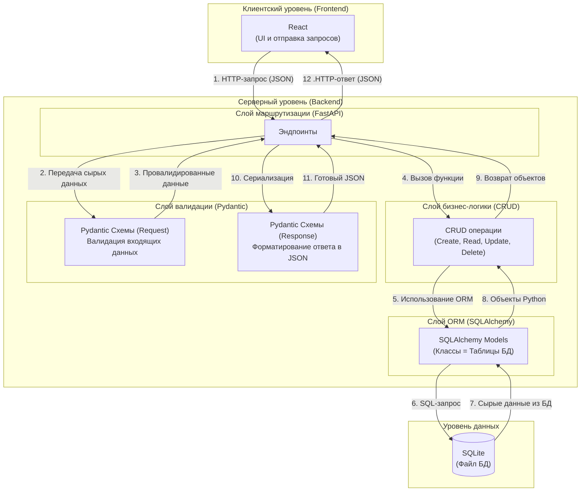

---
tags:
  - architecture
  - stage_1
status: active
created: 23-10-2026
---
# Архитектура

## Структура сервиса "Этап 1"

```mermaid
flowchart TD
    subgraph Client ["Клиентский уровень (Frontend)"]
        React["React\n(UI и отправка запросов)"]
    end

    subgraph Server ["Серверный уровень (Backend)"]
        direction TB
        
        subgraph API_Layer ["Слой маршрутизации (FastAPI)"]
            Endpoints["Эндпоинты"]
        end

        subgraph Logic_Layer ["Слой бизнес-логики (CRUD)"]
            CRUD["CRUD операции\n(Create, Read, Update, Delete)"]
        end

        subgraph Schema_Layer ["Слой валидации (Pydantic)"]
            PydanticIn["Pydantic Схемы (Request)\nВалидация входящих данных"]
            PydanticOut["Pydantic Схемы (Response)\nФорматирование ответа в JSON"]
        end

        subgraph ORM_Layer ["Слой ORM (SQLAlchemy)"]
            Models["SQLAlchemy Models\n(Классы = Таблицы БД)"]
        end
    end

    subgraph Data ["Уровень данных"]
        SQLite[("SQLite\n(Файл БД)")]
    end

    React -- "1. HTTP-запрос (JSON)" --> Endpoints
    
    Endpoints -- "2. Передача сырых данных" --> PydanticIn
    PydanticIn -- "3. Провалидированные данные" --> Endpoints
    
    Endpoints -- "4. Вызов функции" --> CRUD
    CRUD -- "5. Использование ORM" --> Models
    Models -- "6. SQL-запрос" --> SQLite
    SQLite -- "7. Сырые данные из БД" --> Models
    Models -- "8. Объекты Python" --> CRUD
    CRUD -- "9. Возврат объектов" --> Endpoints
    
    Endpoints -- "10. Сериализация" --> PydanticOut
    PydanticOut -- "11. Готовый JSON" --> Endpoints
    
    Endpoints -- "12 .HTTP-ответ (JSON)" --> React
```